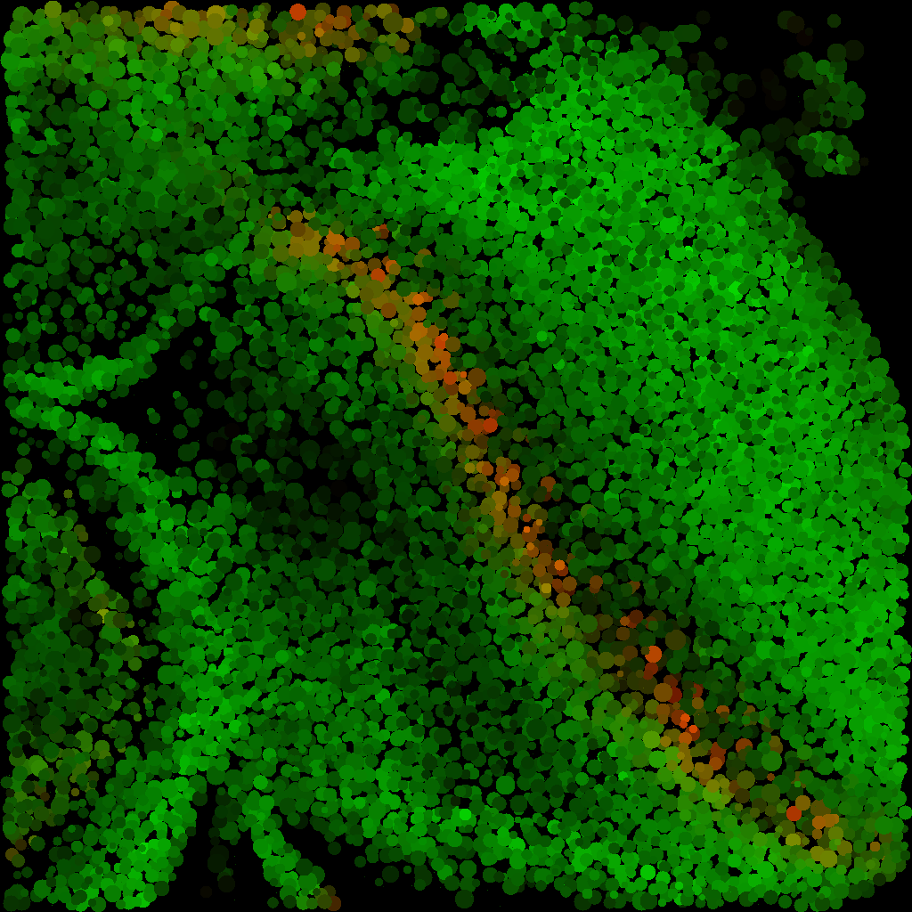

# nuclearP

This project aims to create a comprehensive set of [Fiji](http://fiji.sc/)/[ImageJ](http://imagej.net/)
command-line utilities for nuclear
segmentation and fluorescence intensity measurements in _Drosophila_ eye discs (or other
complex tissue). It uses [Deconvolution Lab](http://bigwww.epfl.ch/algorithms/deconvolutionlab/)
for Tikhonov-Mueller deconvolution, [WEKA](http://fiji.sc/Trainable_Weka_Segmentation) for
machine learning-based probability map calculation and
[3D ImageJ Suite](http://imagejdocu.tudor.lu/doku.php?id=plugin:stacks:3d_ij_suite:start) for
final segmentation and 3D object management.

The macros are implemented in Jython and use Java APIs of plugins listed above.

In short, these macros can be used to transform a 3D confocal image like this (only a single slice is shown):


into a list of objects that can be visualized like this:



## License

nuclearP is dual licensed under [GPL](http://www.gnu.org/licenses/gpl.txt) and
[CC BY 4.0](http://creativecommons.org/licenses/by/4.0/)

with the following restriction on scientific publishing:

_This is a scientific piece of software, currently unpublished. You are free to use it in your project,
however you should NOT publish your paper before we publish ours unless you obtain permission
from us to publish your paper with us on callaboration basis._

## How to use these scripts

### Image segmentation

To run the segmentation script from console using default options follow this example:
```
fiji --headless ./NuclearSegmentation.py \
    --input-dir=./examples/input/ \
    --class-model=./examples/nuclei-test.model \
    --deconv-psf=./examples/psf-test.tif \
    --output-dir=../output
```

You can set the following segmentation parameters:
```
fiji --headless ./NuclearSegmentation.py \
    --input-dir=../Input \
    --output-dir=../Output \
    --img-channel=1 \
    --deconv-psf=../Parameters/PSF-SP8-63x-1024-Venus.tif \
    --deconv-lambda=0.01 \
    --deconv-k=50 \
    --class-model=../Parameters/SP8-63x-1024-Venus.model \
    --gauss-xy=0.4 \
    --gauss-z=0.4 \
    --seg-bkgd-thr=8192 \
    --seg-seed-thr=127 \
    --seg-seed-r=4 \
    --seg-watershed=true \
    --seg-vol-min=50 \
    --seg-vol-max=10000
```

### Visualization of results

To generate a pseudoimage from the raw image and the object list CSV:
```
fiji --headless ./Plotter.py \
    --input-csv=../Output/Results/OBJ_mCh-disc-1.csv
    --input-image=../Input/mCh-disc-1.tif
    --output-image=../Output/Pseudoimage/mCh-disc-1.tif
```

### Parameter optimization

To generate parameters file for optimizer:
```
fiji --headless ./SegmentationOptimizer.py \
    --params-out='parameters.csv' \
    --gauss-xy-min=0 \
    --gauss-xy-max=5.2 \
    --gauss-xy-step=0.2 \
    --gauss-z-min=0 \
    --gauss-z-steps=5 \
    --seg-bkgd-thr-min=4096 \
    --seg-bkgd-thr-max=36864 \
    --seg-bkgd-thr-step=4096 \
    --seg-seed-r-min=2 \
    --seg-seed-r-max=13 \
    --seg-seed-r-step=2
```

To run simulation for single paramater set:
```
fiji --headless ./SegmentationOptimizer.py \
    --one-shot=true \
    --gauss-xy=2 \
    --gauss-z=1 \
    --seg-bkgd-thr=12288 \
    --seg-seed-r=2 \
    --input-file=./examples/PM1_C0-sample.tif \
    --output-dir=../output/ \
    --output-file=simulation-2-1-12288-2.csv
```

To run simulations for the whole paramater array:
```
fiji --headless ./SegmentationOptimizer.py \
    --gauss-xy-min=0 \
    --gauss-xy-max=3 \
    --gauss-xy-step=1 \
    --gauss-z-min=0 \
    --gauss-z-steps=1 \
    --seg-bkgd-thr-min=12288 \
    --seg-bkgd-thr-max=16384 \
    --seg-bkgd-thr-step=4096 \
    --seg-seed-r-min=2 \
    --seg-seed-r-max=4 \
    --seg-seed-r-step=2 \
    --input-file=./examples/PM1_C0-sample.tif \
    --output-dir=../output/ \
    --output-file=simulation-results.csv
```

### High performance computing

These are two PBS scripts for use on clusters/supercomputers in the
`nuclearP/hpc-scripts/` subdirectory. `optimizer-worker.pbs` is an example
job for optimizing segmentation parameters. `fullscale-worker.pbs` is an
example of segmentation job. These scripts are using
[worker framework](https://github.com/gjbex/worker) and should be
submitted using `wsub`:

```
wsub -threaded -batch fullscale-worker.pbs -data image-list.csv
```
